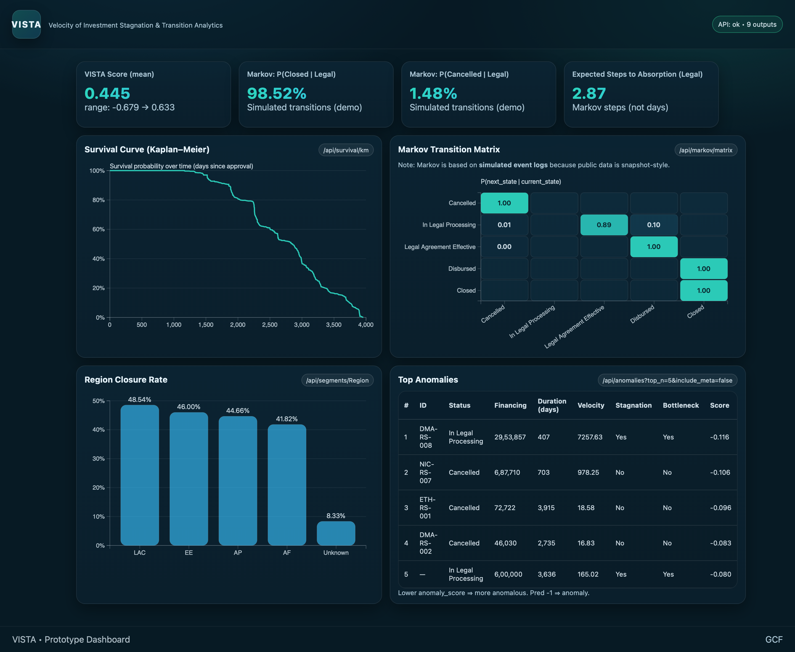
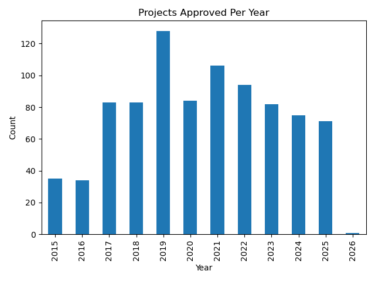
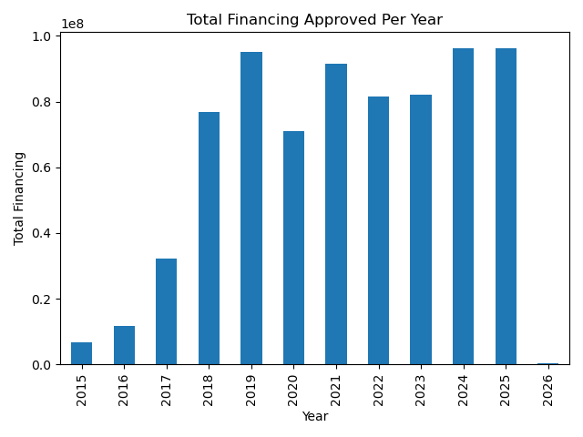
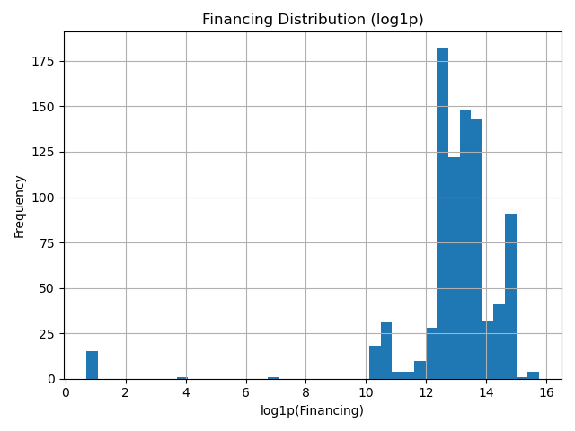

# 🌍 GCF-VISTA Pipeline Tracker  
## VISTA — Velocity of Investment Stagnation & Transition Analytics

A modular portfolio-level analytics engine designed to evaluate **climate finance pipeline health, transition dynamics, and stagnation risk** using publicly available Green Climate Fund (GCF) datasets.

---

## 🖥 Dashboard Interface Preview

---

# 🎯 Institutional Objective

VISTA is built to answer one core governance question:

> **How efficiently is climate capital transitioning from approval to absorption — and where does stagnation occur?**

Using open GCF Readiness and Accredited Entity data, VISTA transforms transparency datasets into structured portfolio intelligence:

- 🔄 Transition diagnostics (Markov modeling)  
- ⏳ Time-to-closure estimation (Kaplan–Meier survival analysis)  
- 🚨 Stagnation & anomaly detection (Isolation Forest)  
- 📊 Regional and segment diagnostics  
- 🧮 A transparent composite prioritization metric (VISTA Score)

The system is modular and designed for institutional scalability if milestone-level timestamps become available.

---

# 📊 Data Sources

**Source:** GCF Open Data Portal  

- Readiness Portfolio Database  
- Accredited Entities Database  

## Snapshot Summary

- **Projects:** 876  
- **Entities:** 161  
- **Approval Date Range:** 2015–2026  
- **Financing Skewness:** 2.21 (right-skewed)  
- **IQR Financing Outliers:** 105 projects  
> Note: 3 duplicate readiness records were removed during preprocessing, resulting in 873 records used for modeling.

## Status Distribution

| Status | Count |
|--------|-------|
| Disbursed | 425 |
| Closed | 392 |
| In Legal Processing | 27 |
| Cancelled | 21 |
| Legal Agreement Effective | 11 |

---

# 📈 Portfolio Scale & Financing Patterns

## Projects Approved Per Year

- Peak approval year: 2019  
- Persistent multi-year lifecycle trend  

## Total Financing Approved Per Year

- Stable capital allocation post-2020  
- Long operational absorption cycles  

## Financing Distribution (Log Scale)

- Heavy right tail behavior  
- Log transformation applied to stabilize variance prior to anomaly modeling.

---

# 🔄 Project Lifecycle Encoding

| State | Description | Type |
|-------|------------|------|
| 0 | Cancelled | Negative absorbing |
| 1 | In Legal Processing | Bottleneck stage |
| 2 | Legal Agreement Effective | Pre-disbursement |
| 3 | Disbursed | Execution phase |
| 4 | Closed | Positive absorbing |

**Absorbing States:**
- Cancelled (0)  
- Closed (4)

---

# 🧠 Analytical Modules

## 1️⃣ Survival Analysis — Kaplan–Meier

**Objective:** Estimate time-to-closure under right-censoring.

Derived variables:

```python
duration_days = today - approved_date
event_closed = 1 if status == "Closed" else 0
```

### Key Findings

- **Mean duration proxy:** ~1903 days  
- **75th percentile:** ~2632 days  
- **Max duration:** ~3956 days (~10.8 years)  

### Interpretation

The portfolio exhibits:

- Multi-year persistence before resolution  
- Significant right-censoring  
- Long structural absorption cycles  

---

## 2️⃣ Markov Transition Modeling (Simulated)

⚠ Public GCF data is snapshot-style and lacks milestone timestamps.  
Synthetic event timelines were generated strictly for modeling demonstration.

### Sample Transition Probabilities

| From | To | Probability |
|------|----|------------|
| Legal (1) | Legal Effective (2) | 0.886 |
| Legal (1) | Disbursed (3) | 0.103 |
| Legal (1) | Cancelled (0) | 0.011 |
| Legal Effective (2) | Disbursed (3) | 0.996 |
| Disbursed (3) | Closed (4) | 1.000 |

### Absorption Probability (Simulated)

From Legal:

- Closed ≈ 98.52%  
- Cancelled ≈ 1.48%  

### Insight

Legal-stage processing appears to be the primary structural bottleneck.  
Once disbursed, projects overwhelmingly transition to closure.

---

## 3️⃣ Anomaly Detection — Isolation Forest

### Features

- `log_financing`
- `duration_days`
- `velocity = financing / duration`
- `stagnation_flag`
- `bottleneck_flag`

### Flagged Patterns

- High financing + prolonged legal stagnation  
- Multi-year duration outliers  
- Rare extreme financing values  

---

## 4️⃣ VISTA Score — Composite Prioritization Metric

A transparent scoring framework combining:

- Status base weight  
- Financing scale  
- Duration penalty  
- Stagnation signals  

### Distribution (Current Snapshot)

- n = 873  
- Mean ≈ 0.445  
- Min ≈ -0.679  
- Max ≈ 0.633  

Lower Scores → stagnation risk  
Higher Scores → absorption efficiency  

---

## 5️⃣ Regional Segment Diagnostics

| Region | Closure Rate |
|--------|--------------|
| LAC | 48.5% |
| EE | 46.0% |
| AP | 44.7% |
| AF | 41.8% |
| Unknown | 8.3% |

Regional variation suggests:

- Structural administrative differences  
- Data consistency issues  
- Uneven absorption performance  

---

## 🖥 System Architecture
```
.
├── backend/
│   ├── processor.py
│   ├── eda.py
│   ├── run_models.py
│   ├── run_markov.py
│   ├── app.py
│   ├── models/
│   │   ├── survival_analysis.py
│   │   ├── isolation_forest.py
│   │   ├── weighting_algo.py
│   │   ├── markov_model.py
│   │   └── simulate_markov_events.py
│   └── data/
│       ├── readiness.xlsx
│       ├── entities.xlsx
│       └── processed/
│           ├── processed_core.csv
│           ├── processed_entity_subset.csv
│           ├── simulated_events.csv
│           └── model_outputs/
│               ├── anomalies.json
│               ├── km_curve.json
│               ├── markov_matrix.json
│               ├── markov_absorption.json
│               ├── markov_dwell.json
│               ├── segment_Region.json
│               ├── vista_scores.json
│               └── vista_summary.json
│
├── frontend/
│   ├── index.html
│   ├── assets/style.css
│   └── js/
│       ├── api.js
│       └── main.js
```
---

## ⚙️ Technology Stack

**Backend:** Flask + Pandas + Scikit-Learn + Lifelines + NumPy  
**Frontend:** D3.js + HTML + CSS + Javascript

---

## 🌐 API Endpoints

| Endpoint | Description |
|----------|------------|
| `/api/health` | Health check |
| `/api/survival/km` | Kaplan–Meier survival curve |
| `/api/anomalies` | Top anomaly cases |
| `/api/vista/summary` | Portfolio overview |
| `/api/segments/Region` | Regional diagnostics |
| `/api/markov/matrix` | Transition matrix |
| `/api/markov/absorption` | Absorption probabilities |
| `/api/markov/dwell` | Mean dwell times |

---

## ⚠️ Methodological Constraints

- Markov transitions are simulated (no milestone timestamps available)  
- Survival analysis uses approval-to-closure proxy  
- Snapshot data prevents true event-sequence reconstruction  
- Entity merge coverage limited  

Transparency regarding limitations is intentional and critical for institutional use.

---

## 🔮 Future Enhancements

### 📊 Data
- Incorporate legal effective & disbursement milestone dates  
- Monthly delta tracking  
- Improved entity matching normalization  

### 🧠 Modeling
- Region-specific Markov matrices  
- Hazard modeling with covariates  
- Explainable anomaly diagnostics  

### 📈 Visualization
- Sankey transition flows  
- Markov heatmaps  
- VISTA score distribution dashboards  

---

## 🚀 How to Run

From `/backend`:

```bash
python processor.py
python run_models.py
python -m models.simulate_markov_events
python run_markov.py
python app.py
```
From `/frontend`:
```bash
 python -m http.server 8000 --bind 127.0.0.1
```

## 🌱 Institutional Relevance

VISTA demonstrates how publicly available climate finance transparency data can be transformed into structured decision intelligence.

The framework supports:

- Transition probability diagnostics  
- Structural bottleneck detection  
- Portfolio absorption efficiency monitoring  
- Risk-informed capital prioritization  

With access to internal milestone-level timestamps, the system could evolve into a real-time pipeline monitoring and early warning tool for climate finance governance.